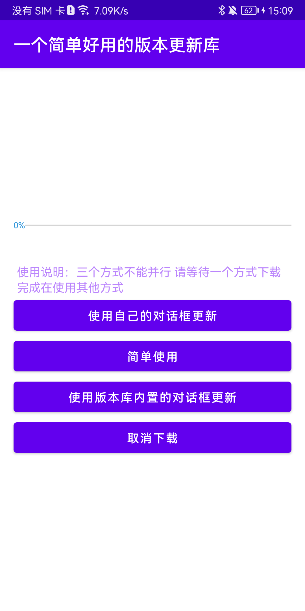
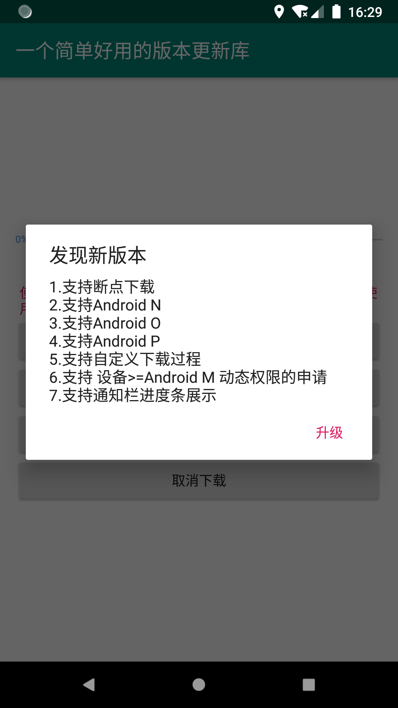
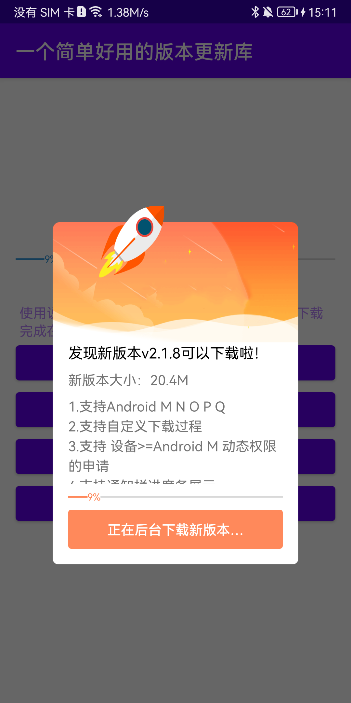
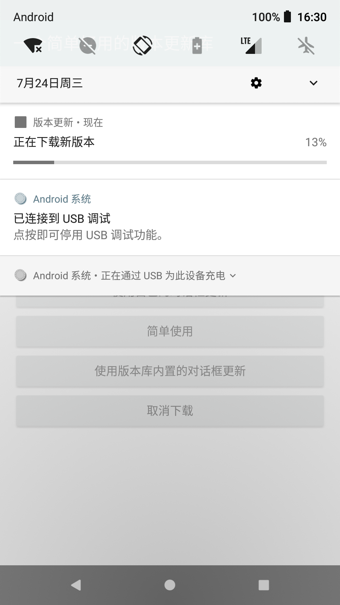
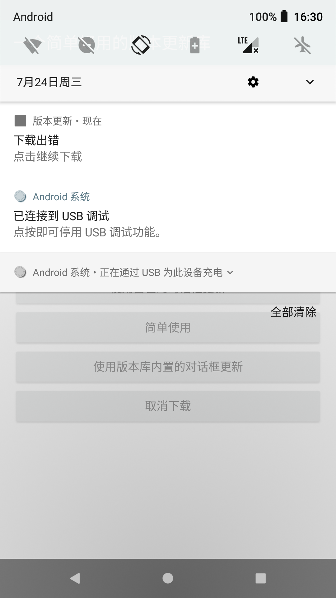
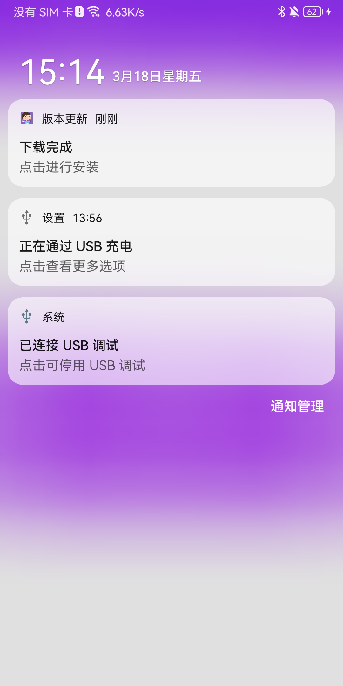
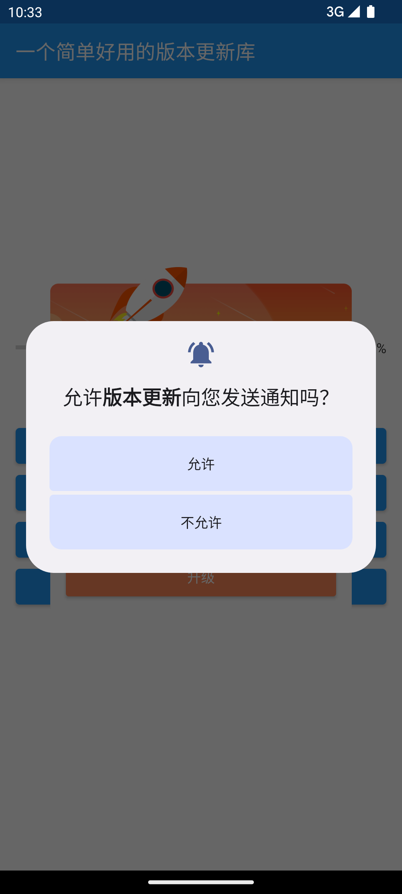
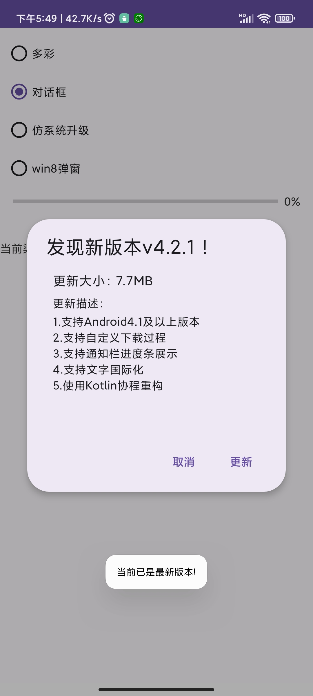
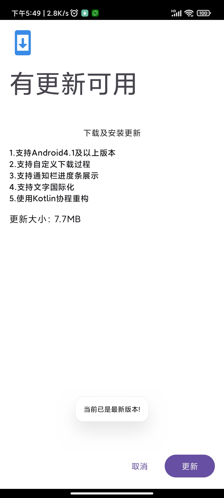
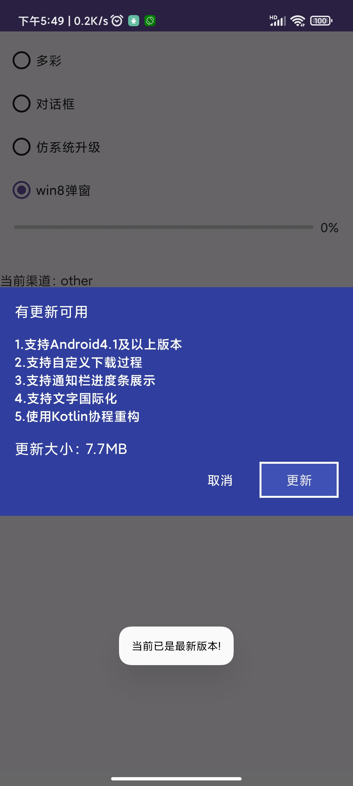

## [English Doc](https://github.com/azhon/AppUpdate/blob/main/README-EN.md)

<p align="center"></p>
<p align="center">
  
  
  
  
</p>

## 本库核心逻辑（必读）：
#### 1、当调用了`apkVersionCode()`设置了最新的VersionCode，则内部会自动判断是否显示对话框、下载和安装
- 适配Android 13通知运行权限，且当设置`showNotification(true)`时，点击对话框的升级按钮会申请通知栏权限，无论是否同意都将会继续下载
- 当设置强制更新`forcedUpgrade(true)`时，显示的对话框会显示下载进度条
#### 2、当没有调用`apkVersionCode()`，就可以把它当成一个下载器，内部只会进行下载和安装
#### 3、由于Android 10限制后台应用启动Activity，所以下载完成会发送一个通知至通知栏（忽略showNotification的值，需要允许发送通知）
#### 4、[更多用法请点此查看](https://github.com/azhon/AppUpdate/blob/main/app/src/main/java/com/azhon/app/MainActivity.kt#L79)

### 相关文档链接
- [限制后台启动Activity](https://developer.android.google.cn/guide/components/activities/background-starts)
- [通知栏适配](https://developer.android.google.cn/guide/topics/ui/notifiers/notifications?hl=zh-cn)

## 目录

* [效果图](#效果图)
* [功能介绍](#功能介绍)
* [Demo下载体验](#demo下载体验)
* [扫码加入QQ群](#扫码加入qq群)
* [使用步骤](#使用步骤)
* [使用技巧](#使用技巧)
* [版本更新记录](#版本更新记录)

### 效果图
　
　
　



### 新添加的内置页面






### 功能介绍

* [x] 支持Kotlin
* [x] 支持AndroidX
* [x] 支持后台下载
* [x] 支持强制更新
* [x] 支持自定义下载过程
* [x] 支持Android4.1及以上版本
* [x] 支持通知栏进度条展示(或者自定义显示进度)
* [x] 支持中文/繁体/英文语言（国际化）
* [x] 支持自定义内置对话框样式
* [x] 支持取消下载(如果发送了通知栏消息，则会移除)
* [x] 支持下载完成 打开新版本后删除旧安装包文件
* [x] 不需要申请存储权限
* [x] 使用HttpURLConnection下载，未集成其他第三方框架

### Demo下载体验

 [点击下载Demo进行体验](https://github.com/azhon/AppUpdate/releases/tag/demo)

### 扫码加入QQ群
- 或者添加加微信：hb958460248（备注 AppUpdate）
- 611136880
- 828385813（已满）

 


### 使用步骤

#### 第一步：`app/build.gradle`添加依赖

```groovy
implementation 'io.github.azhon:appupdate:4.2.10'
```

<details>
<summary>由于GooglePlay政策禁止应用内更新，所以可以通过多渠道的方式进处理</summary>

- [GooglePlay政策](https://support.google.com/googleplay/android-developer/answer/9888379?hl=en&ref_topic=9877467)
- 本库提供了一个没有任何实现的版本[点击查看详细内容](https://github.com/azhon/AppUpdate/blob/main/app/build.gradle)
```groovy
android {
    //...
    productFlavors {
        other {}
        googlePlay {}
    }
}

dependencies {
    otherImplementation 'io.github.azhon:appupdate:latest-version'
    googlePlayImplementation 'io.github.azhon:appupdate-no-op:latest-version'
}
```
</details>

#### 第二步：创建`DownloadManager`，更多用法请查看[这里示例代码](https://github.com/azhon/AppUpdate/blob/main/app/src/main/java/com/azhon/app/MainActivity.kt)

DownloadManager是个单例，每次配置`DownloadManager`时，都会取消上一个下载任务，用新的配置开始下载。

如果要判断当前没有没下载，可以调用如下方法进行判断

```kotlin
    DownloadManager.isDownloading()
```

#### Builder构造下载

* 增加了viewType方法修改下载界面

```kotlin
val downloadManager =DownloadManager.Builder(this).run{
  //Optional parameters...
  apkUrl(url)
  apkVersionCode(2)
  apkVersionName("v4.2.1" )
  apkSize("7.7MB")
  apkName(this@MainActivity.apkName)
  smallIcon(R.mipmap.ic_launcher)
  apkDescription(getString(R.string.dialog_msg))
  viewType(ViewType.SimpleDialog)//修改样式
  build()
}
downloadManager.download(activity)//如果不增加此参数，viewType则不起作用

```

#### 新的使用方式

**如果需要显示内置的对话框那么你需要在配置downloadmanager时指定viewType类型。**

**如果指定了apkVersionCode，将自动判断是否需要升级**

* 注

如果需要自定义界面，在配置的时候将viewType指定为ViewType.None，这将不显示内置界面。

在配置的时候通过registerDownloadListener方法监听下载进度。

配置完成拿到manager后，通过调用manager.download()开始下载文件。


下面是其中一个downloadApp方法的定义，是个接收者函数，因此可以直接在activity或拿到activity的代码中使用

`fun AppCompatActivity.downloadApp(config: DownloadManager.Config): DownloadManager`

* 使用方式
  通过DownloadManager.config(application)方法构造一个manager,然后通过downloadApp方法完成配置。
  如果指定viewtype为非ViewType.None,将显示内置界面

```kotlin
//配置一个downloadmanager
val manager = DownloadManager.config(application) {
    		//这里指定使用内置的不同更新界面，如果需要自己定制界面，指定为ViewType.None      
    		viewType = ViewType.Colorful
            apkUrl = url
            apkName = this@MainActivity.apkName
            smallIcon = R.mipmap.ic_launcher
            apkVersionCode = 2
            apkVersionName = "v4.2.1"
            apkSize = "7.7MB"
            apkDescription = getString(R.string.dialog_msg)
            //对于之前的更新页面的配置
            //新添加的内置更新页面不适用
            configDialog {
//              dialogImage=R.drawable.ic_dialog
//              dialogButtonColor=Color.parseColor("#E743DA")
//              dialogProgressBarColor=Color.parseColor("#E743DA")
                showNewerToast = true
                dialogButtonTextColor = Color.WHITE
            }
            forcedUpgrade = false
        }

//显示更新界面
val manager = downloadApp(manager!!)
```
* 或者，更简单一些，直接配置并显示更新界面，也能拿到downloadmanager。

```
直接通过downloadApp方法构造downloadmanager并显示更新界面
val manager=downloadApp {
            //。。。。。
     		//跟上面一样的配置
        }
```

* 如果要自定义下载界面
```kotlin
 val manager = downloadApp {
    viewType = ViewType.None //不用内置界面
    apkUrl = url
    apkName = this@MainActivity.apkName
    smallIcon = R.mipmap.ic_launcher
    apkVersionCode = 2
    apkVersionName = "v4.2.1"
    apkSize = "7.7MB"
    apkDescription = getString(R.string.dialog_msg)
    showNotification = true
    showBgdToast = false
    forcedUpgrade = false
    enableLog(true)
    jumpInstallPage = true
    registerDownloadListener(listenerAdapter)//自行监听下载进度
}

button.setOnClickListener {
    manager.checkThenDownload()//立即开始下载
}
```

调用showUi显示正在下载的信息

#### 第三步：混淆打包，只需保持`Activity`、`Service`不混淆

```groovy
-keep public class * extends android.app.Activity
-keep public class * extends android.app.Service
```

### 使用技巧

* 框架内部支持国际化（其他语言只需要在对应的`string.xml`中取相同的名字即可）
* 如果你需要修改框架内部的一些文字，你只需要在`string.xml`中取相同的名字即可以覆盖框架内设定的
* 查看版本库中的Log只需要过滤`AppUpdate`开头的Tag
* 支持校验安装包的MD5避免重复下载，只需要`Builder`设置安装包的MD5即可
* 下载完成 打开新版本后删除旧安装包文件

#### 删除旧安装包
现在，下载的安装包会放入 /sdcard/Android/data/包名/cache/AppUpdateCache 下
而不会放在/sdcard/Android/data/包名/cache 下

```kotlin
//删除某一个文件
val result =
    ApkUtil.deleteOldApk(this, "${externalCacheDir?.path}/${Constant.cacheDirName}/$apkName")

//删除所有下载的文件
ApkUtil.deleteDefaultCacheDir(application)
```

```kotlin
//旧版本apk的文件保存地址
val result = ApkUtil.deleteOldApk(this, "${externalCacheDir?.path}/appupdate.apk")
```

* 温馨提示：升级对话框中的内容是可以上下滑动的哦！
* 如果需要实现自己一套下载过程，只需要继承`BaseHttpDownloadManager`

```kotlin
class MyDownload : BaseHttpDownloadManager() {}
```

### 版本更新记录

* v4.3.2（2023/12/18）

  * [修复] Targeting S+ requires FLAG IMMUTABLE bug

* [更多更新记录点此查看](https://github.com/azhon/AppUpdate/wiki/Home)

* v4.2.10（2023/07/18）

  * [优化] [合并PR](https://github.com/azhon/AppUpdate/pull/154)

* [更多更新记录点此查看](https://github.com/azhon/AppUpdate/wiki/Home)

### 赞赏
> 如果这个库有帮助到你并且你很想支持库的后续开发和维护，那么你可以扫描下方二维码随意打赏我，我将不胜感激[赞赏列表](https://github.com/azhon/AppUpdate/wiki/%E8%B5%9E%E8%B5%8F%E5%88%97%E8%A1%A8)


